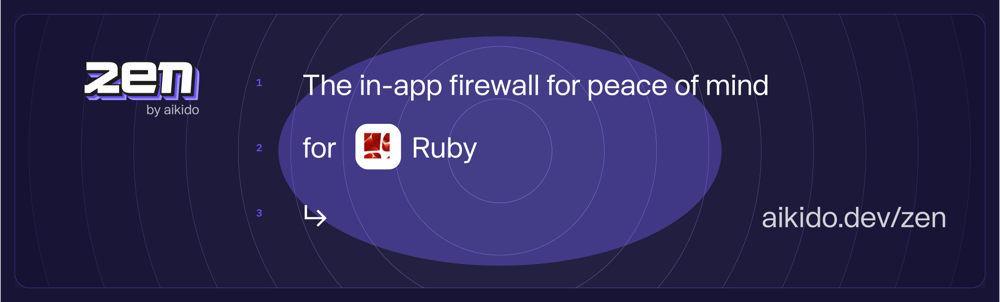

[](https://badge.fury.io/rb/aikido-zen)
[](http://makeapullrequest.com)
[](https://github.com/AikidoSec/firewall-ruby/actions/workflows/main.yml)
[](https://github.com/AikidoSec/firewall-ruby/actions/workflows/release.yml)

# Zen, in-app firewall for Ruby | by Aikido

Zen, your in-app firewall for peace of mind—at runtime.

Zen by Aikido is an embedded Web Application Firewall that autonomously protects
Ruby on Rails apps against common and critical attacks.

It protects your Rails apps by preventing user input containing dangerous
strings, preventing SQL injection and SSRF attacks. It runs embedded on your
Rails application, for simple installation and zero maintenance.

* 🛡️ [SQL injection attacks](https://www.aikido.dev/blog/the-state-of-sql-injections)
* 🛡️ [Server-side request forgery (SSRF)](https://github.com/AikidoSec/firewall-node/blob/main/docs/ssrf.md)
* 🛡️ [Command injection attacks](https://www.aikido.dev/blog/command-injection-in-2024-unpacked) (coming soon)
* 🛡️ [Path traversal attacks](https://www.aikido.dev/blog/path-traversal-in-2024-the-year-unpacked) (coming soon)
* 🛡️ [NoSQL injection attacks](https://www.aikido.dev/blog/web-application-security-vulnerabilities) (coming soon)

Zen operates autonomously on the same server as your Rails app to:

* ✅ Secure your app like a classic web application firewall (WAF), but with none of the infrastructure or cost.
* ✅ Rate limit specific API endpoints by IP or by user.
* ✅ Allow you to block specific users manually.

## Supported libraries and frameworks

Zen for Ruby 2.7+ is compatible with:

### Database drivers

* ✅ [sqlite3](https://github.com/sparklemotion/sqlite3-ruby) 1.x, 2.x
* ✅ [pg](https://github.com/ged/ruby-pg) 1.x
* ✅ [trilogy](https://github.com/trilogy-libraries/trilogy) 2.x
* ✅ [mysql2](https://github.com/brianmario/mysql2) 0.x

### ORMs and Query Builders

See list above for supported database drivers.

* ✅ [ActiveRecord](https://github.com/rails/rails)
* ✅ [Sequel](https://github.com/jeremyevans/sequel)

### HTTP Clients

* ✅ [net-http](https://github.com/ruby/net-http)
* ✅ [http.rb](https://github.com/httprb/http) 1.x, 2.x, 3.x, 4.x, 5.x
* ✅ [httpx](https://gitlab.com/os85/httpx) 1.x (1.1.3+)
* ✅ [HttpClient](https://github.com/nahi/httpclient) 2.x, 3.x
* ✅ [excon](https://github.com/excon/excon) 0.x (0.50.0+), 1.x
* ✅ [patron](https://github.com/toland/patron) 0.x (0.6.4+)
* ✅ [typhoeus](https://github.com/typhoeus/typhoeus) 0.x (0.5.0+), 1.x
* ✅ [curb](https://github.com/taf2/curb) 0.x (0.2.3+), 1.x
* ✅ [em-http-request](https://github.com/igrigorik/em-http-request) 1.x
* ✅ [async-http](https://github.com/igrigorik/em-http-request) 0.x (0.70.0+)

## Installation

We recommend testing Zen locally or on staging before deploying to production.

```
bundle add aikido-zen
```

or, if not using bundler:

```
gem install aikido-zen
```

For framework specific instructions, check out our docs:

* [Ruby on Rails apps](docs/rails.md)

## Running in production (blocking) mode

By default, Zen will only detect and report attacks to Aikido.

To block requests, set the `AIKIDO_BLOCK` environment variable to `true`.

See [Reporting to Aikido](#reporting-to-your-aikido-security-dashboard) to learn
how to send events to Aikido.

## Reporting to your Aikido Security dashboard

> Aikido is your no nonsense application security platform. One central system
> that scans your source code & cloud, shows you what vulnerabilities matter,
> and how to fix them - fast. So you can get back to building.

Zen is a new product by Aikido. Built for developers to level up their security.
While Aikido scans, get Zen for always-on protection.

You can use some of Zen’s features without Aikido, of course. Peace of mind is
just a few lines of code away.

But you will get the most value by reporting your data to Aikido.

You will need an Aikido account and a token to report events to Aikido. If you
don't have an account, you can sign up for free.

Here's how:

* Log in to your Aikido account.
* Go to "Zen" on the sidebar.
* Click on "Add App".
* Choose a name for your App.
* Click "Continue to Install"
* Click "Generate Token".
* Copy the token.
* Set the token as an environment variable, `AIKIDO_TOKEN`, using
  [dotenv](https://github.com/bkeepers/dotenv) or another method
  of your choosing.

## Performance

We run a benchmark on every commit to ensure Zen has a minimal impact on your
application's performance.

For example, here's a benchmark that runs a single GET request to a Rails
endpoint that performs a single SQL SELECT query:

| Without Zen      | With Zen      | Difference    |
|------------------|---------------|---------------|
| 3.527ms          | 3.583ms       | +0.056ms      |

Using Ruby 3.3, Rails 7.1, SQLite 1.7, running on a MacBook Pro M1 Pro. Results
will vary based on hardware.

See [benchmarks](benchmarks) for more information.

## Bug bounty program

Our bug bounty program is public and can be found by all registered Intigriti
users at: https://app.intigriti.com/researcher/programs/aikido/aikidoruntime

## Contributing

See [CONTRIBUTING.md](.github/CONTRIBUTING.md) for more information.

## Code of Conduct

See [CODE_OF_CONDUCT.md](.github/CODE_OF_CONDUCT.md) for more information.

## License

This program is offered under a commercial and under the AGPL license. You can
be released from the requirements of the AGPL license by purchasing a commercial
license. Buying such a license is mandatory as soon as you develop commercial
activities involving the Zen software without disclosing the source code of your
own applications.

For more information, please contact Aikido Security at this address:
support@aikido.dev or create an account at https://app.aikido.dev.
